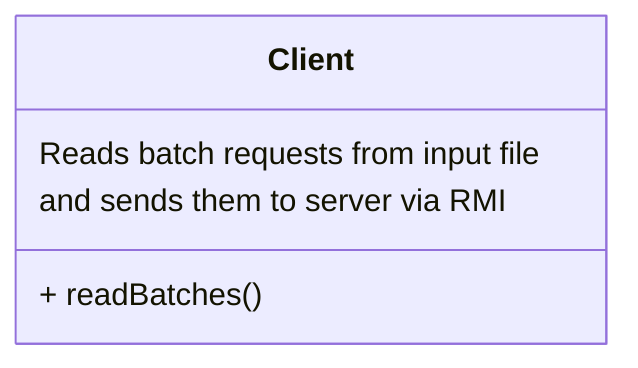
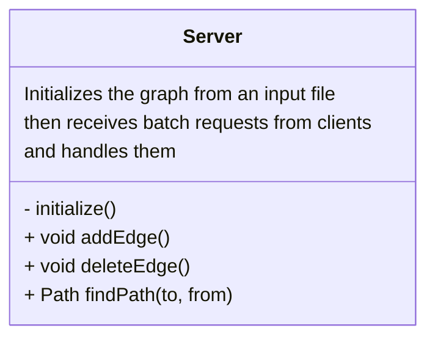
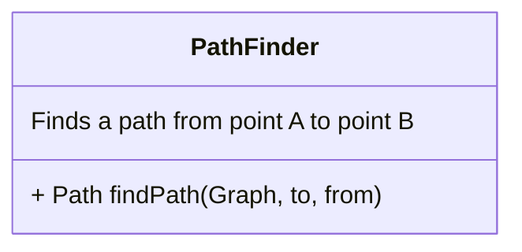

```mermaid
classDiagram
	class Client{
		Reads batch requests from input file
		and sends them to server via RMI
		+ readBatches()
	}
```

```mermaid
classDiagram
	class Server{
		Initializes the graph from an input file
		then receives batch requests from clients
		and handles them
		- initialize()
		+ void addEdge()
		+ void deleteEdge()
		+ Path findPath(to, from)
	}
```

```mermaid
classDiagram
	class PathFinder{
		Finds a path from point A to point B
		+ Path findPath(Graph, to, from)
	}
```
